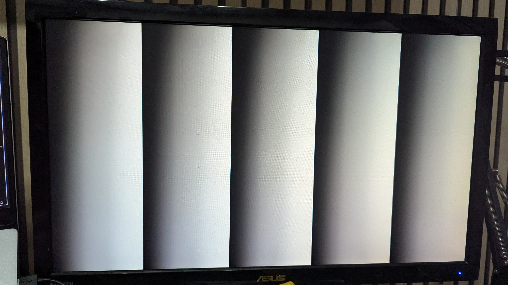
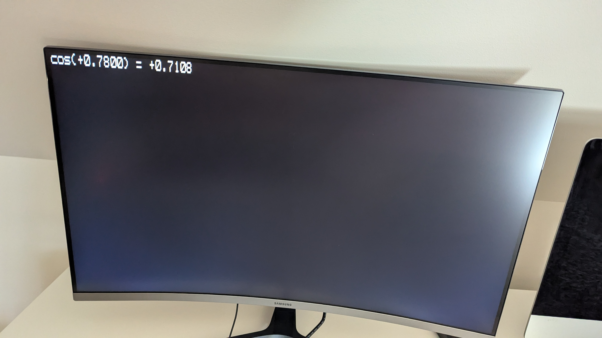

# Mini FPGA Project made for PYNQ-Z2

This is a collection of FPGA projects that I implemented in order to aquire basic FPGA skills like: 
- Writing **RTL** modules with **System Verilog**, **Verilog**, and **VHDL**;
- Writing **Testbenches** with **System Verilog**, and **CocoTB**;
- Getting familiar with **TCL commands** for **constraints file**, adding **delays**, and **scripting**;
- Getting familiar of using **version control** with FPGA projects;
- Getting a better understanding of **Timing Analysis**.

## Contents

## Directory Structure

```
fpga-starting-mini-projects/
    rebuild.tcl   - TCL script created by Vivado.
    rtl/          - Verilog (or VHDL) source code.
    tb/           - Verilog (or VHDL, CocoTB with Python) testbenches.
    cons/         - Constraint files.
    ip/           - Xilinx IP.
    rsc/          - Memory and header files.
    bit/          - Generated bitstream files.
```
### Building

Use this command to create the Vivado Project :
```bash
vivado -source rebuild.tcl
```

## Projects

All projects are in the same source files. 

Projects are listed in creation order.

In order to start Synthesis, Implementation and Bitstream Generation for the right Project, be sure to make active the rigth constraint set and set the right top file as top.

| Projects                           | Top Module                                                             | Constraint Set                                                    |
| ---------------------------------- | ---------------------------------------------------------------------- | ----------------------------------------------------------------- |
| Blinking Led at 1 Hz               | [Blinking_Led.vhd](rtl/Blinking_Led.vhd)                               | [constrs_blinking_led](cons/blinking_led_constraints.xdc)         |
| Counter with Seven Segments        | [Counter_7Segment.vhd](rtl/Counter_7Segment.vhd)                       | [constrs_counter_7segment](cons/counter_7segment_constraints.xdc) |
| Square Pattern with HDMI at 480p   | [Square_Pattern_Hdmi_480p_Top.sv](rtl/Square_Pattern_Hdmi_480p_Top.sv) | [constrs_hdmi](cons/hdmi_constraints.xdc)                         |
| Square Pattern with HDMI at 720p   | [Square_Pattern_Hdmi_720p_Top.sv](rtl/Square_Pattern_Hdmi_720p_Top.sv) | [constrs_hdmi_720p](cons/hdmi_720p_constraints.xdc)               |
| Pong Game with HDMI at 720p        | [Pong_720p_Top.sv](rtl/Pong_720p_Top.sv)                               | [constrs_pong_720p](cons/pong_720p_constraints.xdc)               |
| Text Overlay with HDMI at 720p     | [Text_Overlay_720p_Top.sv](rtl/Text_Overlay_720p_Top.sv)               | [constrs_text_overlay_720p](cons/text_overlay_720p.xdc)           |
| Text Patterns with HDMI at 720p    | [Test_Pattern_720p_Top.sv](rtl/Test_Pattern_720p_Top.sv)               | [constrs_test_pattern_720p](cons/test_pattern_constraints.xdc)    |
| CORDIC Algorithm with HDMI at 720p | [CORDIC_Algorithm_HDMI_Top.sv](rtl/CORDIC_Algorithm_HDMI_Top.sv)       | [constrs_cordic_algorithm_hdmi](cons/cordic_algorithm_hdmi.xdc)   |

### 1 - Blinking Led at 1 Hz

Using a clock enable for making a LED blink 1 second at a time.

### 2 - Counter with Seven Segments

Using FPGAs PMOD and connect it to LEDs to mimick a SevenSegment. 

Clock enabled logic of the previous project helped building the counter.

### 3 - Patterns with HDMI at 480p

Displayed different patterns with the help of an HDMI module I made.

| SW1 | SW2 | OUTPUT              |
|-----|-----|---------------------|
| 0   | 0   | Pink Colour Pattern |
| 0   | 1   | Cross Pattern       |
| 1   | 0   | Ombre Pattern       |
| 1   | 1   | Multicolour Pattern |

#### Pink Colour Pattern


#### Cross Pattern


#### Ombre Pattern


#### Multicolour Pattern


### 4 - Square Pattern with HDMI at 720p

Displaying a white square, but with a resolution of 720p.


### 5 - Test Patterns with HDMI at 720p

Same as [Pattern with HDMI 480p](#3---patterns-with-hdmi-at-480p), but with 720p.

#### Pink Colour Pattern


#### Cross Pattern


#### Ombre Pattern



#### Multicolour Pattern


### 6 - Pong Game with HDMI at 720p

A simple pong game against a boot. To reset the game toggle SW1 on the FPGA.

https://github.com/user-attachments/assets/09459296-7057-4081-8110-78d0a2bcf719

### 7 - Text Overlay with HDMI at 720p

Displaying a character on the screen.


#### Version 1


#### Version 2


### 8 - CORDIC Algorithm with HDMI at 720p

Implemented all CORDIC operations with fixed values. 

Not all operations are displayed on the screen yet, work in progress.

#### Displayed Cos Only



## Resources

- How to setup Vivado with git: https://github.com/jhallen/vivado_setup
- www.xilinx.com/publications/archives/xcell/Xcell79.pdf
- https://digitalsystemdesign.in/wp-content/uploads/2019/01/cordic1.pdf
- https://www.secs.oakland.edu/~llamocca/Courses/ECE5736/S22/FinalProject/Group3_hypcordic.pdf
- https://en.wikibooks.org/wiki/Digital_Circuits/CORDIC
- https://fpga.mit.edu/6205/F24/assignments/hdmi
